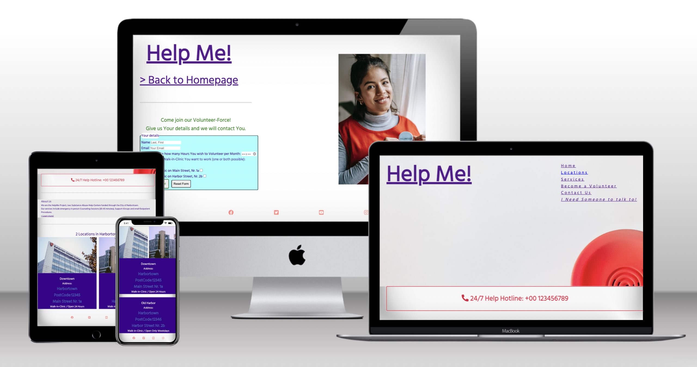

<h1>Help Me!</h1>
A website for the fictitious HelpMe!-Project.
It is meant to serve as a digital point of first contact with potential patients as well as people who are interested in volunteering their time and provide the basic information, like: the addresses of the two clinics

View the live site <a href="https://joysalchert.github.io/J.S.-CI-Project.1-Help-Me-/" target="_blank">here</a>

