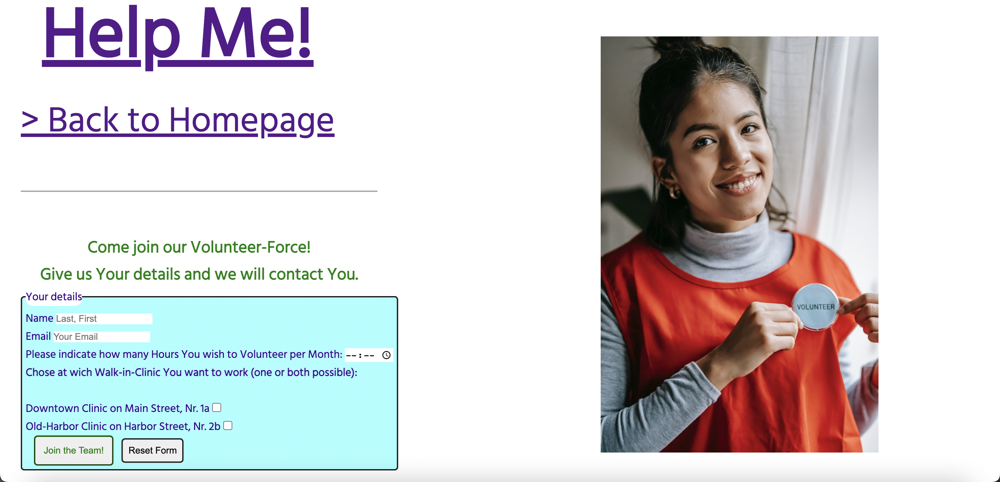

# Help Me!
A website for the fictitious HelpMe!-Project.
It is meant to serve as a digital point of first contact with potential patients as well as people who are interested in volunteering their time and provide the basic information, like: the addresses of the two clinics

View the live site <a href="https://joysalchert.github.io/J.S.-CI-Project.1-Help-Me/" target="_blank">here</a>

## Features
### Navigation menu on home page and services page:
unordert list containing anchors to id's and html-forms linking them together and enabeling the user to move araund the website intuitively.

### Logo and Form menu exeption (Logo + Back to hompage promt):
The side wide Loge (HelpMe!) also contains an anchor linking it back to the top of the hompage. 
I made the decision to not include the navigation menu on the Form page because it looked cluttered and unnessesary. 
Instead I basicaly expanded the Logo to include a reminder that it brings the user back to the Home page.

### Footer:
The side wide Footer section holds an unordert list witch contains social media links (to home pages, if the Organization was real thier social links would go here).

### Existing Features:
- Responsive design (for screens under 800px wide).
- Hompage with Hero image, about us article with internal link to services page. The Home page also showcases info on Clinic Locations and Help Hotline as well as navigation to the other two pages vie the menu.

- Volunteer signup Form page with Form.

- Services Page with information articels and navigation menu.

## Design
> Pretty much free-hand!

## Technologies
- HTML: 
Was used to give the website its structure and semantic meaning.
- CSS: 
The website was styled with CSS on the style.css external file.
- GitHub: 
The Source code is hosted on GitHub and deployed via GitPages.
- Git: 
Used to commit and push code during the development of the website.
- Font Awesome: 
I got my icons from https://kit.fontawesome.com/7986ee263b.js Version5.
- Google Fonts: 
The Font Hind Siliguri is from https://fonts.googleapis.com/css2?family=Hind+Siliguri&display=swap ,sans-serif was used as backup.

## Testing
- Responsivnes: 
The Website was tested on 3 devices (MacBookAir, iPadAir, iPhone13) and in developer tools. 
It passed my expectations the simple design is also very forgiving witch is why I made the decision to only make CSS media queries for small screens (under 800px).
- Accessibility: 
Wave Accessibility tool was used for the final testing of the edployed website. 
The result:

The Location sections came back with a low contrast error, 
but I did not act on this since I wanted to achive the font outline effect 
(I susspect that the Wave tool can not recognise the -webkit-text-stroke). 
In my opinion the Azure has a high enough contrast to the Purple background (please dont fail me for this!).

Testing focused on:
- Color contrasts meet minimum ratio set in WCAG 2.1 Contrast Guidlines.
- Semantic elements like h1, p, article... are used properly.
- HTML page lang atribute is set.
- alt, title, aria-label atributes where used on all not text content.
- Adherence to the WCAG 2.1 Coding best practices.

## Light House Testing

## Functional Testing

- Navigation Links: 
Testing was done by clicking on all of the navigation links the ones in the Navigation Menue as well as the embedded links in the logo and the ("> learn more" link conecting the "About Us" section to the services page).
Result = all the navigation links worked on all 3 html files(index.html, services_page.html and form.html) the hover background-color change also works for all the links in the navigation menu.

- Form Testing: 
The hover background-color change works for both the Submit and the Reset input element. 
Forms are sent to https://formdump.codeinstitute.net . 
The requiered fields: Name, Email and Volunteer-Hours all throw up errors when not filled out correctly, as ecpected.

- Social Media Links Testing: 
All the social media icons link to the correct social media platform and are opened in a new tab.

## Deployment

- The site was created using the GidPod code editor and pushed to github to the repository (J.S.-CI-Project.1-Help-Me-).
- I used the folowing comands to push the code from the GitPod Workspace to the repository:
> git add . 
> git commit -m "Message" 
> git push

- Deployment to Github Pages: 
I deployed the finished website to Gidhub Pages and got the folowing live link: 
https://joysalchert.github.io/J.S.-CI-Project.1-Help-Me-/

## Credits
- I took the HTML and CSS code for the footer from the CI-Love-Runnig-Project.
- I took my mentors (Gareth McGirr) README.md file as the outline for my README.md file.
- I used generel google queries when I got stuck (mostly W3Schools material).

## Content and Media
I wrote all the HTML/CSS code and Content-Text (exept for the footer section, 
wich I took and altered from the CI-Love-Runnig-Project). 
The images where free to use from https://www.pexels.com/ .
